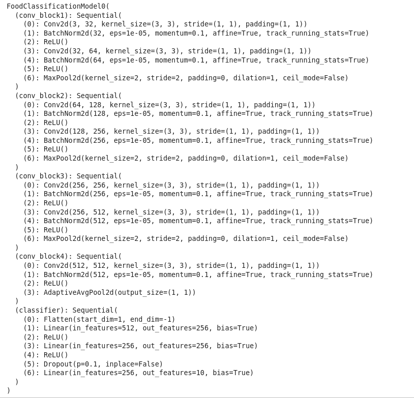
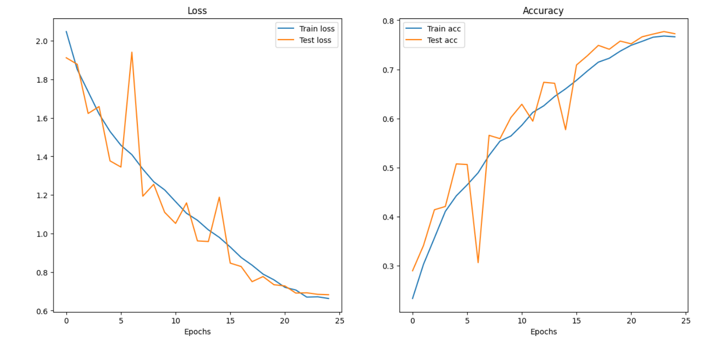
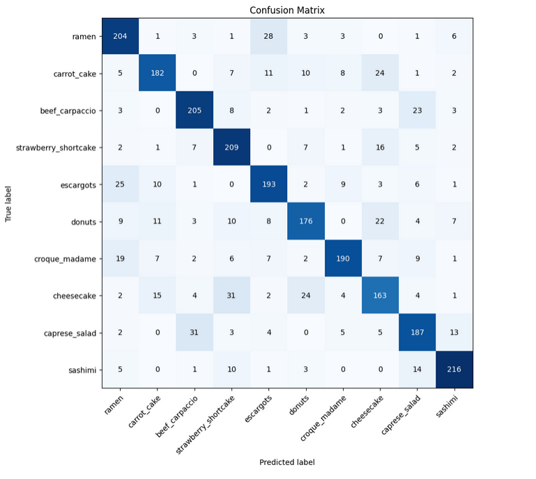

# PyTorch Showcase Project

This project is an experiment on CNN architecture, using the large [Food101](https://www.kaggle.com/datasets/dansbecker/food-101). I chose VGG-based architecture because it's simple and I wanted to test it on a large number of classes. This project covers:

- Data preprocessing
- Reducing 101 classes to fewer classes (to save a model and save computational resources)
- Creating `Dataset` and `DataLoader`
- Designing and implementing a CNN model
- Training, evaluating and visualizing results

## Examples

To improve performance and save computation time, I randomly selected 10 classes from the 101 classes. 
(In the very end, after I find the best model, I use it on 101 classes)

Here are examples of the best model performance on these 10 classes:

### Model architecture (32 hidden units)

  

### Model metrics (loss and accuracy curves over 25 epochs):

  

### Confusion Matrix:

  

## Project Goals:

- Explore capabilities and limitations of a simple VGG-based CNN
- Gain hands-on experience with the complete PyTorch workflow
- Showcase model development process for portfolio purposes

## Technologies Used:

- Python 3.13+
- PyTorch 2.10 +
- JupyterLab
- torchvision, torchmetrics, pandas, matplotlib, numpy.

## How to run?

1. Clone the repository:
```bash
    git clone https://github.com/Car1LL/Food101-VGG-based-model
    cd Food101-VGG-based-model
```
2. Install dependencies:
```bash
    pip3 install -r requirements.txt
```
3. Open JupyterLab and follow the notebook

NOTE: The dataset Food101 you have to download manually, it is not included in this repository. You can download it from this [website](https://www.kaggle.com/datasets/dansbecker/food-101). Follow the notebook for futher instructions.


## Additional Resources:

* [Example of how CNN works](https://poloclub.github.io/cnn-explainer/)
* [Site with lots of datasets](https://www.kaggle.com/)
* [torchvision transforms visual illustrations](https://docs.pytorch.org/vision/main/auto_examples/transforms/plot_transforms_illustrations.html)
